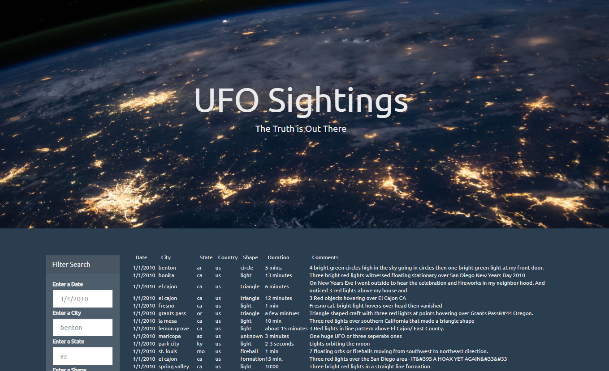
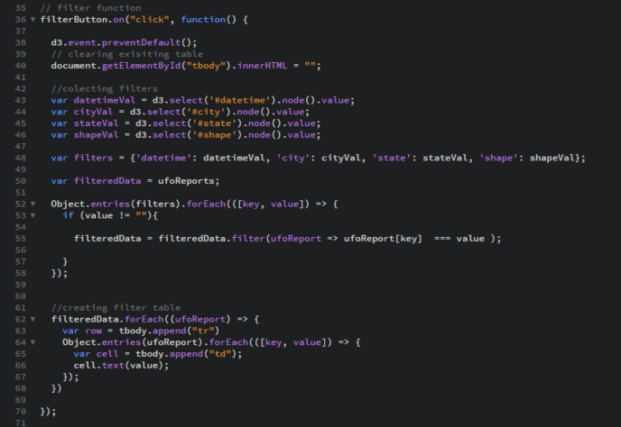

# UFO Sighting Dashboard

## Demonstration website using d3.js to filter a local js file's data refining what is displayed on the dashboard.
Note: to run this locally, you either need to initiate a local http.server `python -m http.server` and view the site in your local browser at `localhost:8000` or by using a text editor that can render the site and support the JS functionality. I'm able to view the site using Brackets text editor...

#### Project Comments:
* Data is stored in JSON format in a local file: data.js
* d3.js is used to filter data objects displayed in the html

